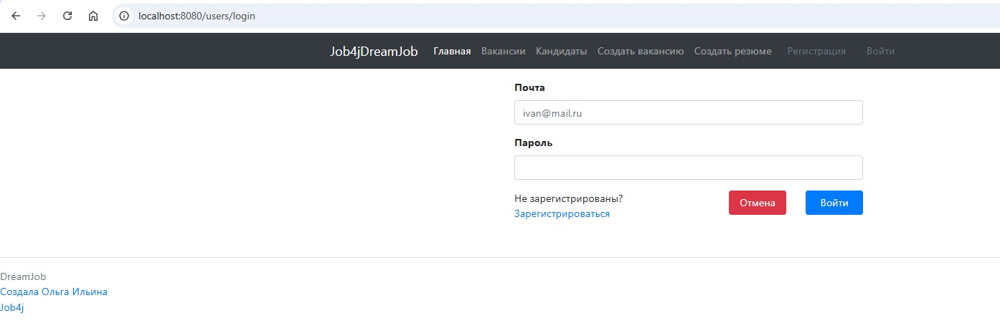
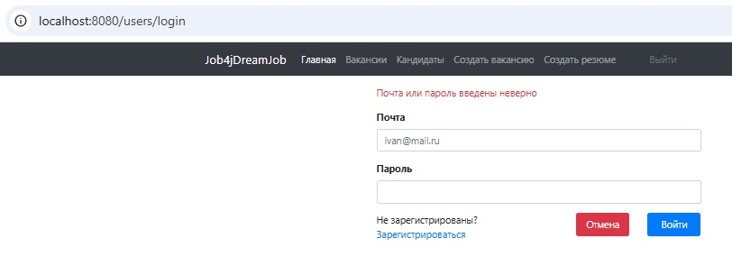
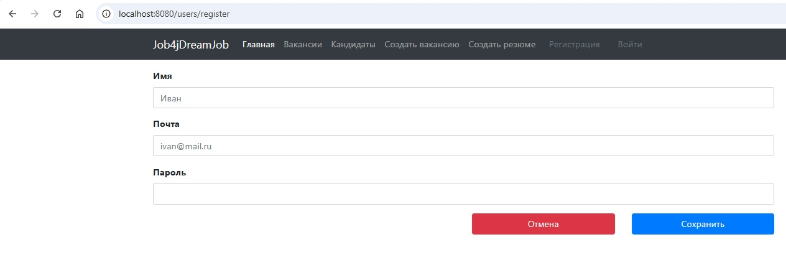
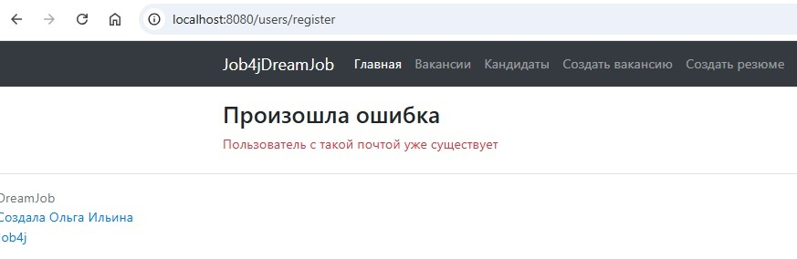
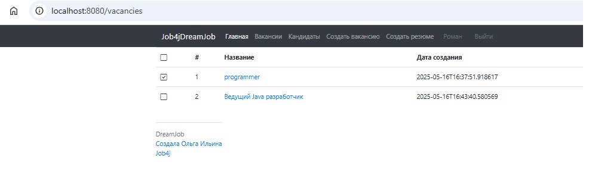
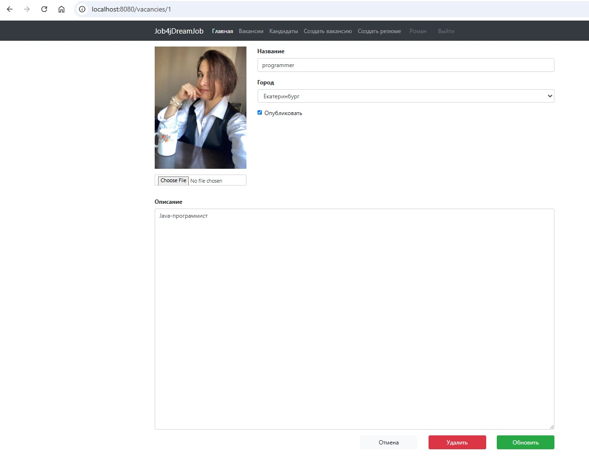
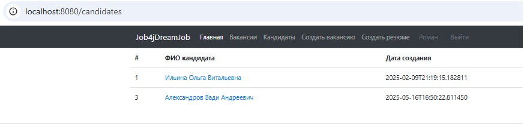
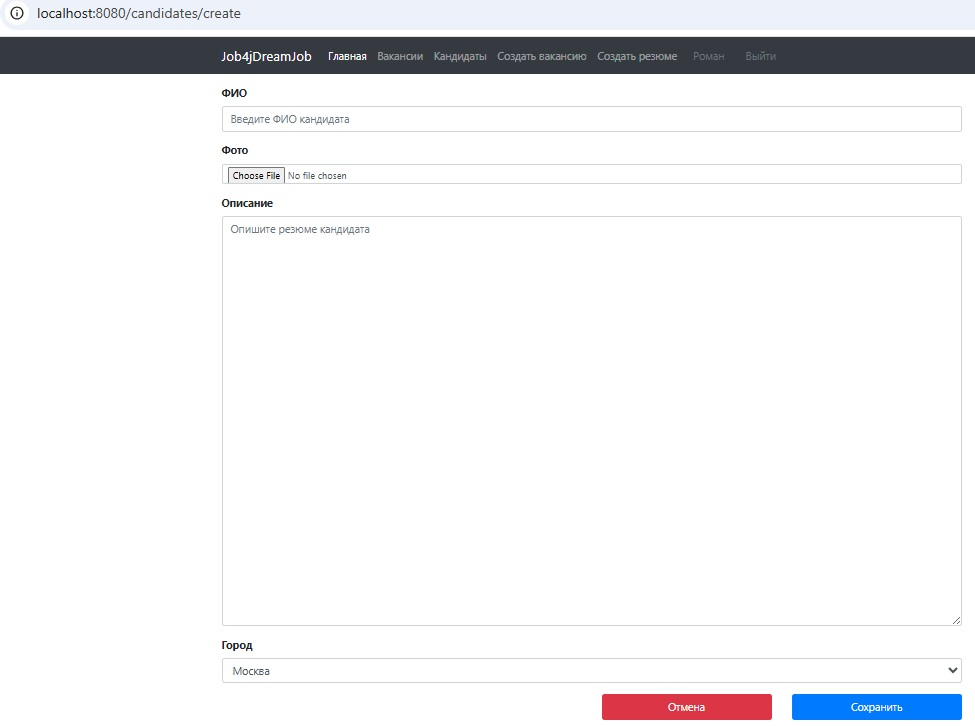
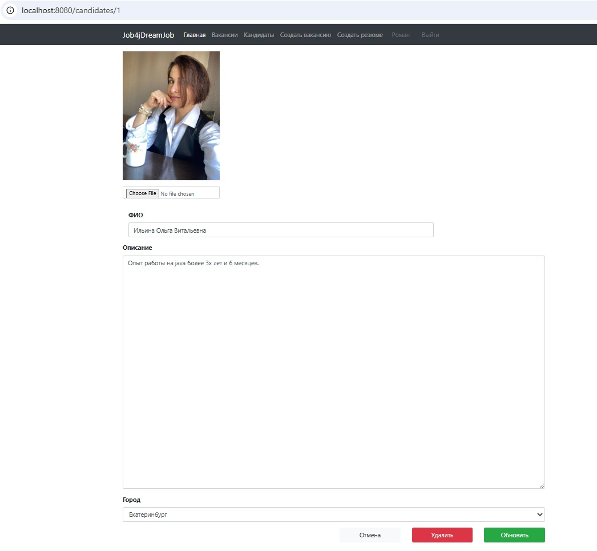

# job4j_dreamjob

### О проекте

Веб-приложение "Работа мечты" реализует базовый функционал работы с вакансиями и резюме.

- кандидаты: публикуют свои резюме и могут откликаться на вакансии.
- кадровики: размещают вакансии и приглашают кандидатов на открытые вакансии.

### Технологии и инструменты

Java 17, Spring Boot 3, Liquibase 4, PostgreSQL

### Требования к окружению

Java 17, Maven 3.4.0, PostgreSQL

### Запуск проекта

``` create database cinema;  ```
``` mvn clean install  ```
и далее запускаем приложение

### Взаимодействие с приложением

#### Скриншоты

##### *Страница авторизации*



##### *Страница авторизации с сообщением о неуспешной авторизации*



##### *Страница регистрации*



##### *Страница регистрации с сообщением о неуспешной регистрации*



##### *Страница списка всех вакансий*



##### *Страница создания вакансии*


##### *Страница редактирования вакансии*



##### *Страница списка всех кандидатов*



##### *Страница создания кандидата*



##### *Страница редактирования кандидата*



#### API

|        |                         |                           |
|--------|-------------------------|---------------------------|
| CET    | /users/login            | Авторизация               |
| POST   | /users/login            | Авторизация               |
| CET    | /users/logout           | Выход из системы          |
| POST   | /users/register         | Регистрация               |
| CET    | /                       | Основная страница         |
| CET    | /index                  | Основная страница         |
| CET    | /vacancies              | Список всех вакансий      |
| GET    | /vacancies/{id}         | Просмотр вакансии         |
| POST   | /vacancies/create       | Создание вакансии         |
| POST   | /vacancies/update       | Редактирование вакансии   |
| DELETE | /vacancies/delete/{id}  | Удаление вакансии         |
| CET    | /candidates             | Список всех кандидатов    |
| GET    | /candidates/{id}        | Просмотр кандидатов       |
| POST   | /candidates/create      | Создание кандидатов       |
| POST   | /candidates/update      | Редактирование кандидатов |
| DELETE | /candidates/delete/{id} | Удаление кандидатов       |
|        |                         |                           |

### Контакты


- Telegram: [@OlgaIlyina0312](https://t.me/OlgaIlyina0312)
- Email:    [oliljina@mail.ru](oliljina@mail.ru)
